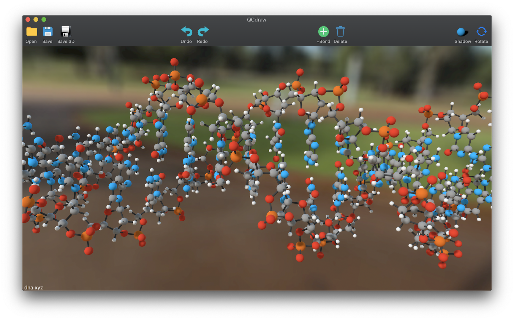
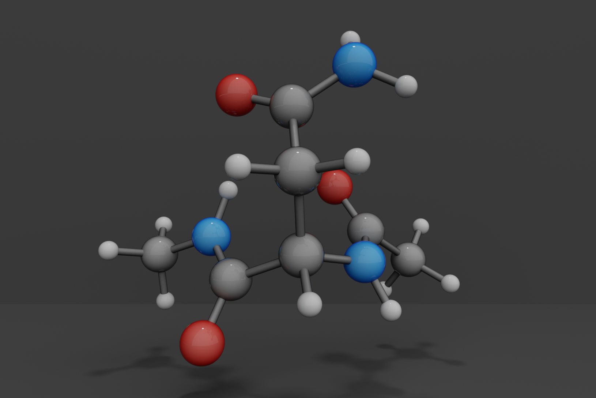

# QCdraw
A Molecular Viewing Program Written in Swift Language

## Screenshot

## Instructions

- Download a pre-built app that runs on OS X 10.14:
    https://github.com/yudongqiu/QCdraw/releases

- For development, clone repo and open `QCdraw.xcodeproj` in Xcode

- The "Export Tungsten Json" feature works with the Tungsten ray tracing render that can produce high quality renderings
    https://github.com/tunabrain/tungsten

